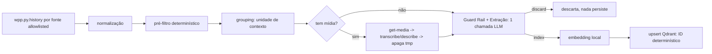

# WPP Ingestion & Search — Design

Refs: `spec.md` (este diretório), `docs/PRD.md`, decisões registradas em
`.specs/project/PROJECT.md`.

## Discovery — reuso confirmado

| Capacidade | Componente reusado | Como |
|---|---|---|
| Chats/histórico/mídia | skill `whatsapp-message` (`wpp.sh`) | subprocess. **Gap**: sem leitura por `startDate`/`endDate` num chat arbitrário — estender com `history <target> --start --end` sobre `getAllMessagesByContactId` |
| Transcrição áudio/vídeo + frames | skill `transcribe-audio-video` (`transcribe_audio.py --frames --format json`) | subprocess |
| Descrição de imagem/frame | **não existe pronto** (a skill deixa a descrição pro agente ler na conversa; `azap-image` usa Gemini, proibido) | chamada direta HTTP a Ollama vision (`gemma4:12b`) |
| Embedding | Ollama (`nomic-embed-text`, já baixado) | HTTP local |
| Vector store | Qdrant dedicado local (docker-compose) | `qdrant-client` |
| Allowlist de fontes | `~/.claude/secrets/whatsapp.env` + `whatsapp-lids.json` | leitura direta em `config.py`, sem duplicar |

## Arquitetura

```
docker-compose: wpp-context (FastAPI+CLI) + qdrant (local, dedicado)

app/
├── adapters/
│   ├── wpp.py           # subprocess sobre wpp.sh (chats, history, get-media)
│   ├── transcription.py # subprocess sobre transcribe_audio.py
│   ├── inference.py     # HTTP -> Ollama: vision (describe) + embedding
│   └── qdrant.py        # qdrant-client: upsert/search/get
├── domain/
│   ├── messages.py      # normalização, pré-filtro determinístico, redaction
│   ├── contexts.py      # unidade de contexto + ID determinístico (hash)
│   └── guardrail.py     # schema Guard Rail+extração, parsing da resposta LLM
├── services/
│   ├── ingestion.py     # orquestra o pipeline fim-a-fim, por chat/unidade
│   ├── grouping.py      # agrupa mensagens em unidades (janela+reply)
│   ├── extraction.py    # monta prompt combinado guardrail+extração
│   ├── embedding.py     # monta texto de embedding + chama inference.py
│   └── search.py        # query -> embedding -> Qdrant -> ranking/boost
├── api/  ingest.py, search.py, source.py
├── cli/  wpp-context (thin wrapper sobre services)
└── config.py             # lê whatsapp.env + whatsapp-lids.json + .env
```

**Por que essa separação:** `adapters/` isola tudo que fala com processo
externo (skills, Ollama, Qdrant) — pode ser trocado/mockado sem tocar
`domain/`. `domain/` é lógica pura (fácil de testar sem subprocess real).
`services/` orquestra. Nenhuma camada nova além do que o PRD §24 já
sugeria — só nomeando os adapters que o discovery confirmou.

## Fluxo de ingestão



**Decisões-chave:**

1. **Guard Rail + extração em 1 chamada LLM** (schema combinado) por
   unidade, não 2. Reduz custo de inferência; separar em 2 chamadas só
   se, na prática, o modelo confundir os campos.
2. **Chat sem mensagem no período → zero escrita.** `wpp.py.history`
   retorna vazio → pipeline não chama nada além disso pra aquele chat;
   nenhum registro "sem conteúdo" em Qdrant/config/log de estado. Só o
   resumo agregado da execução (`messages_read`) reflete isso.
3. **ID determinístico** = `hash(company, chat_id, sorted(message_ids),
   extractor_version)`. Upsert idempotente — reprocessar não duplica.
4. **Erro por unidade não aborta o batch.** Estado por unidade:
   `processed|skipped|failed_media|failed_guardrail|failed_embedding|failed_index`,
   logado sanitizado (sem base64/transcrição integral/segredo), batch
   segue.
5. **Mídia é sempre temporária.** Download → processa → apaga em
   `finally`, independente do resultado do Guard Rail.

## Busca

```
query -> embedding local (nomic-embed-text) -> Qdrant (dense + filtro payload)
      -> se query bate padrão de identificador exato (URL/ticket/hash/endpoint)
         -> boost de match lexical em topics/title/urls
      -> resultados (score, evidência, source_url)
```

Sem LLM generativa (spec P1, critério 2). `services/search.py` é a única
camada que decide o boost léxico — API/CLI só chamam essa service.

## Source resolver

`api/source.py`: `GET /api/v1/source/{context_id}` lê o payload no
Qdrant e devolve `message_ids`/chat; `GET /api/v1/source/media/{message_id}`
delega a `wpp.py.get_media` (subprocess `wpp.sh get-media`) sob demanda,
sem cache permanente (cache temporário de curtíssima duração é aceitável
se necessário, com cleanup garantido).

## Configuração (sem hard-code de modelo)

```env
VISION_MODEL=gemma4:12b
EMBEDDING_MODEL=nomic-embed-text
OLLAMA_BASE_URL=http://host.docker.internal:11434  # localhost from INSIDE the container is wrong; host-run code (pytest/cron) overrides to localhost
INGEST_CONCURRENCY=1
MEDIA_CONCURRENCY=1
CONVERSATION_GAP_MINUTES=20
QDRANT_URL=http://qdrant:6333   # container local do compose
```

Allowlist de fontes não entra em `.env` do projeto — é lida direto de
`~/.claude/secrets/whatsapp.env` + `whatsapp-lids.json` (path
configurável, default esse).

## Erros & observabilidade

Por execução (`run_id`): `messages_read`, `prefilter_discarded`,
`guardrail_discarded`, `contexts_indexed`, `images_processed`,
`audio_processed`, `videos_processed`, `errors`, `duration_seconds`
(PRD §19.1). Nunca logar conteúdo pessoal/segredo/base64/transcrição
integral.

## Testes

- **Unit** (`domain/`, sem subprocess real): normalização, ID
  determinístico, redaction regex, parser da resposta do Guard Rail,
  construção do texto de embedding, ranking/boost.
- **Integração**: Qdrant real local (docker), adapters WPP/transcription
  mockados via stub de subprocess (fixtures sintéticas: texto, imagem
  simulada, áudio mock, vídeo mock, link, reply, pessoal, mista — nunca
  conversa real).
