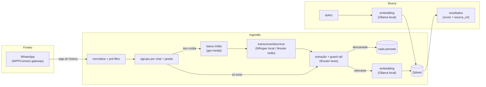

# wpp-context-index

Índice/busca de contexto sobre mensagens WhatsApp (WPP), com ingestão
multimodal (texto/mídia) para Qdrant. Local-first: nenhuma mensagem sai
pra LLM externa (embeddings e descrição de imagem rodam em modelos locais
via Ollama). Ver `docs/PRD.md` para o produto completo.

## Como isso conversa com o WhatsApp

Este projeto **não fala com o WhatsApp diretamente** — ele consome a API
REST de um gateway já rodando em cima do
[WPPConnect](https://github.com/wppconnect-team/wppconnect) (a lib
open-source que abre uma sessão do WhatsApp Web via Puppeteer e expõe as
mensagens por HTTP). `app/adapters/wpp.py` só faz `subprocess` sobre o
`wpp.sh` (script separado, não incluso aqui) que chama esse gateway —
`getAllMessagesByContactId`, `getAllChats`, `getBase64File` etc. Sem um
gateway WPPConnect (ou compatível) rodando e acessível, a ingestão não
tem o que ler.

## Como isso conversa com os modelos

Embeddings vão direto pro Ollama local (`WPP_OLLAMA_URL`). Extração de
texto e descrição de imagem passam por um gateway
[9router](https://github.com/decolua/9router) local (`NINE_ROUTER_URL`,
combo `NINE_ROUTER_COMBO`) — ele escolhe/roteia entre modelos locais e
gratuitos com fallback automático, então nenhuma chamada de texto/visão
depende de uma única API paga fixa. `app/adapters/inference.py` cobre os
dois casos.

## Fluxo



## Setup

```bash
cp .env.example .env   # ajuste WPP_OLLAMA_URL/QDRANT_URL etc.
docker compose up -d
```

Pré-requisitos externos a este repo:
- Um gateway WPPConnect com sessão do WhatsApp autenticada, acessível
  via o wrapper de `wpp.sh` referenciado em `app/adapters/wpp.py`.
- Ollama local com o modelo de `EMBEDDING_MODEL`.
- Um gateway [9router](https://github.com/decolua/9router) local
  (`NINE_ROUTER_URL`) com um combo configurado para `VISION_MODEL`/`TEXT_MODEL`.
- Allowlist de contatos/grupos em `WHATSAPP_ENV_PATH`/`WHATSAPP_LIDS_PATH`
  (arquivos locais, fora do controle de versão — ver `.env.example`).

## Uso da CLI

```bash
python -m app.cli ingest --start 2026-09-01 --end 2026-09-18   # TUI rich com progresso ao vivo
python -m app.cli search "onde mandaram o mockup?"
```

## Uso da API

```bash
docker compose up -d   # ou: uvicorn app.main:app --reload

# dispara ingestão (assíncrona, roda em background) — devolve run_id
curl -sX POST localhost:8000/api/v1/ingest \
  -H 'Content-Type: application/json' \
  -d '{"start": "2026-09-01T00:00:00", "end": "2026-09-18T00:00:00"}'
# → {"run_id": "...", "status": "running"}

# consulta status/resultado (poll até status != "running")
curl -s localhost:8000/api/v1/ingest/<run_id>
# → {"run_id": "...", "status": "completed", "summary": {...}}

# busca
curl -sX POST localhost:8000/api/v1/search \
  -H 'Content-Type: application/json' \
  -d '{"query": "onde mandaram o mockup?", "limit": 5}'
```

`POST /api/v1/ingest` só devolve `run_id` — sem progresso incremental
(a TUI ao vivo é exclusiva da CLI). `filters`/`limit` em `/search` são
opcionais.

## Agendamento (ingestão diária via cron do host)

PRD §18 proíbe Celery/Redis/scheduler novo. A ingestão diária roda via
cron do host chamando `scripts/ingest-yesterday.sh`, que calcula a janela
"ontem 00:00 até hoje 00:00" (fuso local) e invoca a CLI `ingest` (T7)
sem modificá-la.

Exemplo de linha de crontab (roda às 03:00, por sugestão do PRD §18):

```cron
0 3 * * * cd /caminho/para/wpp-context-index && ./scripts/ingest-yesterday.sh >> /var/log/wpp-context-ingest.log 2>&1
```
