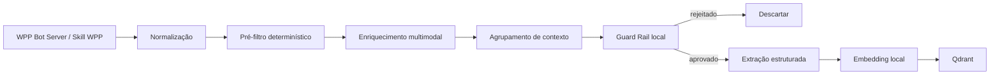
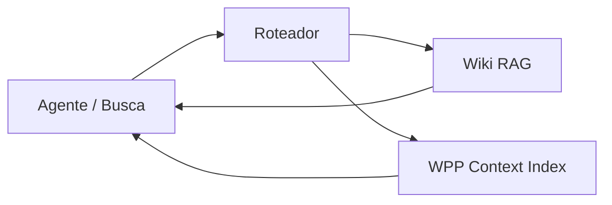

# PRD — WPP Context Index
**Status:** Draft para implementação  
**Data:** 2026-09-18  
**Tipo:** POC / MVP local-first  
**Nome de trabalho:** `wpp-context-index`

---

## 1. Visão geral

Criar uma ferramenta local, executada em Docker, capaz de transformar conversas corporativas do WhatsApp em um índice pesquisável por linguagem natural.

A solução deve consumir mensagens já disponíveis no **WPP Bot Server**, identificar apenas conteúdo profissional relevante, processar texto e mídias com componentes locais já existentes, gerar embeddings e indexar o resultado no **Qdrant**.

O objetivo não é criar um chatbot para o WhatsApp e nem armazenar uma cópia completa das conversas. O objetivo é criar uma camada de **contexto corporativo pesquisável**, semelhante em filosofia a ferramentas como grepAI/Graphify: trabalho mais pesado na ingestão e consulta barata no uso diário.

Exemplos de perguntas que a ferramenta deve ajudar a responder:

- "Onde mandaram o mockup da tela de cancelamento?"
- "Quem enviou aquele link do Figma sobre a tarefa de boleto?"
- "Em qual grupo falaram sobre o erro ao alterar vencimento?"
- "Teve algum vídeo mostrando o bug da tela branca?"
- "Onde está a captura de tela que o suporte enviou sobre o cliente X?"
- "Quando discutiram a integração com a MikWeb?"
- "Quem comentou sobre timeout nessa rotina?"
- "Ache a conversa em que decidiram mudar esse comportamento."

A resposta da busca deve priorizar **evidência e rastreabilidade**, retornando:

- trecho/resumo indexado;
- grupo ou DM de origem;
- autor(es);
- data/hora;
- tipo de conteúdo;
- IDs das mensagens;
- score da busca;
- referência local para recuperar a mensagem/mídia original sob demanda.

---

## 2. Princípios obrigatórios

### 2.1 Local-first

O MVP deve operar localmente.

Não usar OpenAI, OpenRouter, Gemini, Anthropic ou qualquer outra API externa no pipeline do MVP.

Os modelos já disponíveis localmente devem ser reutilizados.

**Não baixar automaticamente novos modelos.**

Durante a fase de discovery o agente deve identificar:

- quais modelos Ollama/local inference já existem;
- qual modelo é usado para embeddings;
- qual modelo textual está disponível;
- qual modelo multimodal/vision está disponível;
- quais modelos são usados pelas skills existentes.

Se alguma capacidade já estiver encapsulada em uma skill existente, a skill tem precedência sobre uma nova implementação.

---

### 2.2 Reuso antes de implementação

Existe pelo menos a skill:

`transcribe-audio-video`

Ela já possui lógica para transcrição e processamento de vídeo/frames.

É proibido reimplementar Whisper, extração de frames, lógica de transcrição ou pipeline equivalente antes de inspecionar e tentar reutilizar essa skill.

Existe também uma skill/CLI relacionada ao WhatsApp/WPP Server. O nome exato deve ser descoberto pelo agente.

Ela aparentemente já suporta parte das operações necessárias, incluindo leitura de mensagens por intervalo de datas e manipulação de mídias.

O agente deve primeiro descobrir o que já existe e somente então implementar o que estiver faltando.

---

### 2.3 Ingestão pesada, consulta leve

A parte pesada acontece no batch.

A busca normal não deve depender de uma LLM generativa.

Fluxo esperado da consulta:

`query -> embedding local -> Qdrant -> ranking/filtros -> resultados`

Um agente externo poderá usar os resultados como contexto e decidir se quer chamar uma LLM depois.

A ferramenta não precisa gerar uma resposta conversacional para cada busca.

---

### 2.4 Privacidade por design

A ferramenta não deve virar um arquivo pesquisável da vida pessoal dos colaboradores.

Antes de qualquer indexação deve existir um **Guard Rail de relevância e privacidade**.

Conteúdo rejeitado pelo Guard Rail:

- não gera embedding;
- não entra no Qdrant;
- não gera resumo persistido;
- não deve permanecer em arquivos temporários após o processamento.

Identidade operacional necessária para rastreabilidade — por exemplo, nome do colaborador que enviou uma informação de trabalho — pode ser mantida.

Conteúdo pessoal sem relação com o trabalho deve ser descartado.

---

### 2.5 Não armazenar mídia

Imagem, áudio e vídeo devem ser buscados no WPP Bot Server apenas quando necessários para processamento ou recuperação pelo usuário.

A ferramenta não deve manter um repositório permanente das mídias.

Depois do processamento:

- apagar arquivo temporário;
- manter somente descrição/transcrição resumida necessária;
- manter metadados;
- manter identificadores suficientes para obter o original novamente no WPP Bot Server.

---

### 2.6 Qdrant como storage principal do MVP

Não adicionar PostgreSQL, Elasticsearch, Redis, Kafka ou outro banco/fila sem necessidade comprovada.

O MVP deve usar Qdrant para:

- vetores;
- payloads;
- filtros;
- campos pesquisáveis;
- metadados da evidência.

Estado mínimo de execução pode ser mantido em configuração/arquivo local caso necessário, mas deve-se preferir idempotência por IDs determinísticos em vez de introduzir outro banco.

---

## 3. Discovery obrigatório antes de codificar

A primeira etapa da implementação é um discovery do ambiente existente.

**Nenhuma implementação relevante deve começar antes desse discovery.**

O agente responsável possui acesso ao ambiente e às skills que não estão disponíveis neste PRD.

### 3.1 Discovery das skills

Localizar e inspecionar:

1. `transcribe-audio-video`;
2. skill/CLI do WPP Bot Server;
3. qualquer skill existente de embeddings;
4. qualquer skill existente de Ollama/local inference;
5. componentes compartilhados que já façam:
   - chamadas HTTP;
   - download temporário;
   - extração de mídia;
   - visão computacional;
   - sanitização;
   - geração de embeddings;
   - acesso ao Qdrant.

Para cada skill/componente relevante, registrar:

- caminho/repositório;
- finalidade;
- comando CLI;
- parâmetros;
- formato de entrada;
- formato de saída;
- códigos de saída/erros;
- dependências;
- se roda dentro de container;
- se depende do host;
- modelos utilizados;
- possibilidade de importação como biblioteca;
- possibilidade de chamada via CLI/subprocess;
- capacidade que falta para este projeto.

### 3.2 Discovery da skill WPP

O agente deve descobrir o nome real da skill e verificar especialmente se já existem operações para:

- listar chats;
- identificar grupos x DMs;
- buscar mensagens por chat;
- buscar por `startDate` / `endDate`;
- recuperar mensagem pelo ID;
- recuperar contexto em torno de uma mensagem;
- recuperar mídia;
- identificar autor;
- identificar nome do grupo;
- identificar timestamp;
- diferenciar texto, imagem, áudio, vídeo, documento e link;
- resolver mensagens citadas/replies;
- trabalhar com IDs `@g.us`, `@c.us` e `@lid`.

Se faltar uma operação pequena, preferir **estender a skill existente** em vez de criar um cliente paralelo duplicado.

### 3.3 Discovery da skill `transcribe-audio-video`

Confirmar:

- como enviar áudio;
- como enviar vídeo;
- se aceita arquivo, URL, base64 ou stdin;
- como retorna transcrição;
- como retorna resumo;
- como retorna frames;
- se os frames já são descritos;
- qual modelo é usado;
- se o modelo fica carregado após cada execução;
- comportamento com arquivos grandes;
- necessidade de FFmpeg;
- arquivos temporários criados;
- política de cleanup.

**Não duplicar essas capacidades no projeto.**

### 3.4 Discovery de modelos locais

Listar os modelos realmente disponíveis.

O código deve utilizar configuração, não hard-code de modelo que talvez não exista.

Exemplo:

```env
EMBEDDING_MODEL=<descoberto-no-ambiente>
TEXT_MODEL=<descoberto-no-ambiente>
VISION_MODEL=<descoberto-no-ambiente-ou-skill>
```

Se a skill já esconde esse detalhe, não duplicar a configuração.

### 3.5 Entregável da fase de discovery

Criar:

`docs/discovery.md`

Com:

- inventário;
- capacidades existentes;
- lacunas;
- decisão de reuso;
- mudanças necessárias nas skills;
- arquitetura final após descoberta.

Também registrar um pequeno quadro:

| Capacidade | Já existe? | Componente | Ação |
|---|---:|---|---|
| Leitura por data | | | |
| Download de mídia | | | |
| Transcrição | | | |
| Frames de vídeo | | | |
| Descrição de imagem | | | |
| Embedding | | | |
| Qdrant | | | |
| Recuperação por messageId | | | |

---

## 4. Integração com WPP Bot Server

OpenAPI de referência:

`https://wpp.boletoazap.dev.br/docs/openapi.json`

A implementação deve usar a skill WPP existente como primeira opção.

Chamada HTTP direta ao WPP Bot Server só deve ser criada quando:

1. a skill não possui a operação;
2. estender a skill não fizer sentido;
3. a decisão estiver documentada no discovery.

### 4.1 Capacidades já conhecidas da API

Na versão do OpenAPI consultada para este PRD existem, entre outras, as seguintes capacidades relevantes:

#### `GET /{empresa}/getAllChats`

Lista chats e informa campos como:

- ID;
- nome;
- `isGroup`.

#### `GET /{empresa}/getAllMessagesByContactId/{contactId}`

Suporta:

- `startDate`;
- `endDate`;
- `count`;
- `limit`;
- paginação por `id`;
- `direction=before|after`;
- `fromMe`;
- `transcribeAudio`;
- `describeImage`;
- inclusão opcional de reactions/polls.

Mensagens que são replies podem trazer `quotedMsgId`.

Essa rota já demonstra que parte da lógica multimodal pode existir no WPP Server. O agente deve inspecionar se essa implementação reutiliza as skills locais existentes antes de escolher o caminho definitivo.

#### `GET /{empresa}/getBase64File/{messageId}`

Permite recuperar mídia de uma mensagem por ID e retorna:

- data URI/base64;
- mimetype;
- tamanho.

Essa operação pode ser usada para obter a mídia temporariamente e entregar à skill apropriada.

### 4.2 Recuperação da mensagem original

O índice deve guardar IDs suficientes para reencontrar o original.

A documentação atual menciona `getMessageById` em descrições, porém a fase de discovery deve confirmar se esse método existe na skill, no código do WPP Server ou apenas internamente.

Ordem de preferência:

1. reutilizar método existente da skill;
2. reutilizar método já existente no WPP Server, mesmo que ainda não documentado;
3. adicionar ao WPP Server/skill um endpoint/método mínimo de recuperação por ID;
4. último recurso: recuperar pequeno contexto ao redor do ID via paginação.

Não criar armazenamento duplicado da mensagem original só para resolver esse problema.

---

## 5. Escopo funcional do MVP

### 5.1 Seleção das fontes

O sistema deve trabalhar somente com chats explicitamente autorizados.

Configuração inicial deve permitir:

- allowlist de grupos;
- allowlist de DMs/contatos corporativos;
- exclusão explícita de chats;
- ativação/desativação individual de uma fonte.

Exemplo conceitual:

```yaml
sources:
  company: minha-empresa

  groups:
    allow:
      - 1203...@g.us
      - 1203...@g.us

  contacts:
    allow:
      - 5521...@c.us

  deny:
    - 5521...@c.us
```

O formato final pode mudar após discovery da skill WPP.

---

### 5.2 Execução em batch

O MVP não precisa processar eventos em tempo real.

Fluxo padrão:

- uma execução por dia;
- preferencialmente à noite;
- intervalo configurável;
- possibilidade de execução manual;
- possibilidade de backfill por intervalo.

Exemplos:

```bash
wpp-context ingest --date 2026-09-17
```

```bash
wpp-context ingest \
  --start 2026-09-01T00:00:00-03:00 \
  --end 2026-09-18T00:00:00-03:00
```

A API também deve oferecer uma rota administrativa para iniciar o batch.

---

### 5.3 Idempotência

Reprocessar o mesmo período não pode duplicar dados.

Gerar IDs determinísticos a partir de informações como:

- empresa;
- chat ID;
- mensagem(ns) de origem;
- versão do agrupador/extrator.

Quando um item for reprocessado, deve ocorrer upsert.

---

## 6. Pipeline de ingestão

Fluxo macro:



### 6.1 Normalização

Converter cada mensagem para um envelope interno comum.

Exemplo:

```json
{
  "company": "empresa",
  "chat_id": "1203...@g.us",
  "chat_name": "Operação",
  "is_group": true,
  "message_id": "false_...",
  "sender_id": "55...@c.us",
  "sender_name": "Fulano",
  "timestamp": "2026-09-17T15:32:10-03:00",
  "type": "image",
  "body": "texto/caption quando houver",
  "quoted_message_id": null,
  "has_media": true
}
```

Esse é um modelo conceitual. O adapter deve mapear o retorno real da skill/WPP Server.

---

### 6.2 Pré-filtro determinístico

Antes de chamar qualquer modelo:

Descartar, quando aplicável:

- mensagens de sistema;
- eventos técnicos sem conteúdo;
- stickers sem contexto útil;
- reações isoladas;
- mensagens vazias;
- duplicatas;
- status;
- mensagens de chats não autorizados.

Também detectar e redigir quando possível:

- tokens;
- senhas;
- OTP;
- secrets;
- chaves de API;
- credenciais explícitas.

Se uma mensagem parecer conter segredo sensível, preferir não indexá-la.

---

### 6.3 Processamento multimodal

#### Texto

Usar o texto diretamente como matéria-prima.

Não é necessário resumir cada mensagem isoladamente.

#### Áudio

Reutilizar `transcribe-audio-video`.

Fluxo:

1. obter mídia temporariamente;
2. chamar skill;
3. obter transcrição;
4. usar transcrição apenas durante o pipeline;
5. descartar arquivo;
6. persistir somente conteúdo aprovado pelo Guard Rail.

#### Imagem

Primeiro descobrir se a skill WPP já usa o modelo multimodal local disponível.

Se existir capacidade reaproveitável, usá-la.

A saída desejada é uma descrição objetiva e voltada a recuperação, por exemplo:

> Captura de tela do painel de cobrança exibindo erro 500 ao alterar data de vencimento; aparece o cliente XPTO e o botão "Salvar".

Não buscar descrição artística.

Dar preferência a:

- texto visível;
- mensagens de erro;
- tela/sistema;
- nome da funcionalidade;
- ticket;
- botão/ação;
- contexto técnico.

#### Vídeo

Reutilizar `transcribe-audio-video`.

Não implementar pipeline próprio de FFmpeg/frame sampling.

A skill existente deve fornecer o máximo possível de:

- transcrição;
- frames;
- descrições;
- resumo técnico.

A mídia é temporária e deve ser removida após o processamento.

#### Documentos

No MVP:

- indexar caption;
- nome do arquivo;
- tipo;
- links existentes na mensagem.

Extração integral de PDF/DOCX pode ficar para fase posterior, a menos que exista uma skill pronta e seu uso seja trivial.

---

## 7. Agrupamento de conversa

Uma mensagem isolada frequentemente perde contexto.

O sistema deve criar **unidades de contexto** antes da indexação.

Exemplo:

```text
14:10 João: o erro continua no vencimento
14:11 Maria: acontece só no cliente antigo?
14:12 João: sim
14:12 João: [imagem]
14:13 João: aqui aparece 500 quando salvo
```

Isso deve preferencialmente virar uma única evidência coerente.

### 7.1 Estratégia inicial

Agrupar por:

- mesmo chat;
- proximidade temporal;
- replies/citações;
- sequência de mídia + mensagens adjacentes;
- tamanho máximo configurável.

Um `conversation_gap_minutes` pode existir, porém deve ser configuração e não regra fixa hard-coded.

Valor inicial sugerido:

`20 minutos`

O agente pode alterar após testes.

### 7.2 Não agrupar um dia inteiro

Não mandar todo o histórico diário como um único prompt.

Motivos:

- cria temas misturados;
- piora rastreabilidade;
- dificulta Guard Rail;
- gera resumos genéricos;
- aumenta retrabalho.

O contexto diário pode ser pequeno para um modelo 8B, mas a qualidade da indexação é melhor com unidades coerentes.

---

## 8. Guard Rail

O Guard Rail é parte central do produto.

Ele deve decidir se uma unidade possui conhecimento corporativo útil para indexação.

### 8.1 Saída estruturada

Exemplo:

```json
{
  "decision": "index",
  "work_relevance": 0.94,
  "contains_personal_content": false,
  "contains_sensitive_data": false,
  "categories": [
    "bug",
    "operacao"
  ],
  "reason": "Discussão de erro operacional reproduzido em tela.",
  "redactions": []
}
```

Ou:

```json
{
  "decision": "discard",
  "work_relevance": 0.08,
  "contains_personal_content": true,
  "contains_sensitive_data": false,
  "categories": [
    "personal"
  ],
  "reason": "Conversa pessoal sem relação com trabalho.",
  "redactions": []
}
```

### 8.2 Conteúdo indexável

Exemplos:

- bug;
- incidente;
- solução;
- workaround;
- decisão;
- arquitetura;
- link técnico;
- mockup;
- protótipo;
- requisito;
- regra de negócio;
- dúvida operacional relevante;
- comportamento de sistema;
- evidência de erro;
- tarefa;
- integração;
- alteração de processo;
- informação necessária para localizar um artefato.

### 8.3 Conteúdo não indexável

Exemplos:

- conversa pessoal;
- saúde;
- família;
- assuntos íntimos;
- piadas sem contexto profissional;
- discussões sociais sem utilidade de trabalho;
- documentos pessoais;
- senha;
- token;
- dados bancários pessoais;
- código de autenticação;
- mídia pessoal;
- conteúdo sem relação com atividades da empresa.

### 8.4 Conteúdo misto

Quando uma unidade mistura conteúdo pessoal e profissional:

- extrair somente o conteúdo profissional;
- remover a parte pessoal;
- manter somente metadados mínimos necessários;
- nunca usar a parte pessoal no embedding.

---

## 9. Extração estruturada

Depois de aprovado pelo Guard Rail, gerar uma unidade indexável.

Exemplo:

```json
{
  "title": "Erro 500 ao alterar vencimento",
  "summary": "No grupo Operação foi reportado erro 500 ao salvar nova data de vencimento para clientes antigos. Uma captura de tela demonstrou o erro.",
  "kind": "bug",
  "topics": [
    "vencimento",
    "cobranca",
    "erro 500"
  ],
  "systems": [
    "painel de cobranca"
  ],
  "ticket_ids": [],
  "urls": [],
  "artifacts": [
    {
      "type": "image",
      "description": "Captura da tela de alteração de vencimento mostrando erro 500."
    }
  ]
}
```

Não exigir uma taxonomia enorme no MVP.

Campos desconhecidos devem ser opcionais.

---

## 10. Modelo de dados no Qdrant

Collection sugerida:

`wpp_context`

Cada ponto representa uma unidade de contexto aprovada.

### 10.1 Vetor

Embedding de um texto composto por:

- título;
- resumo;
- termos relevantes;
- descrição de artefatos;
- texto técnico útil.

Não inserir lixo de metadados no texto do embedding.

---

### 10.2 Payload mínimo

```json
{
  "schema_version": 1,

  "company": "empresa",

  "kind": "bug",

  "title": "Erro 500 ao alterar vencimento",
  "summary": "...",

  "topics": [
    "vencimento",
    "cobranca"
  ],

  "chat": {
    "id": "1203...@g.us",
    "name": "Operação",
    "is_group": true
  },

  "senders": [
    {
      "id": "55...@c.us",
      "name": "João"
    }
  ],

  "source": {
    "message_ids": [
      "false_...",
      "false_..."
    ],
    "first_timestamp": "2026-09-17T14:10:00-03:00",
    "last_timestamp": "2026-09-17T14:13:00-03:00"
  },

  "media": [
    {
      "message_id": "false_...",
      "type": "image",
      "description": "Captura de tela mostrando erro 500."
    }
  ],

  "urls": [],
  "ticket_ids": [],

  "guardrail": {
    "version": "v1"
  },

  "extractor_version": "v1"
}
```

### 10.3 Não persistir no payload

Por padrão, não guardar:

- base64;
- binário;
- vídeo;
- áudio;
- imagem original;
- transcrição completa se ela contiver informação que não é necessária;
- conversa pessoal rejeitada;
- credenciais.

---

## 11. Busca

### 11.1 Objetivo

A busca precisa resolver tanto linguagem natural quanto identificadores exatos.

Exemplos semânticos:

- "problema ao mudar vencimento"
- "vídeo de erro no boleto"

Exemplos exatos:

- `ABC-123`
- URL do Figma;
- nome de arquivo;
- código de erro;
- nome de endpoint;
- número de PR/ticket.

### 11.2 Estratégia

MVP deve combinar:

1. dense embedding;
2. filtros de payload;
3. match lexical/exato quando houver identificadores.

Não adicionar Elasticsearch.

Se a versão do Qdrant utilizada permitir full-text/sparse search de forma simples, ela pode ser usada para melhorar o match exato.

A busca não deve depender de uma LLM generativa.

### 11.3 Detecção de query exata

Quando a consulta possuir padrões como:

- URL;
- ticket;
- hash;
- endpoint;
- filename;
- código de erro;
- identificador;

dar peso maior ao match lexical/exato.

### 11.4 Resultado

Exemplo:

```json
{
  "query": "mockup cancelamento",
  "results": [
    {
      "id": "ctx_...",
      "score": 0.87,
      "title": "Mockup da tela de cancelamento",
      "summary": "Fulano enviou o protótipo...",
      "kind": "artifact",
      "chat_name": "Produto",
      "senders": [
        "Fulano"
      ],
      "first_timestamp": "2026-09-16T10:22:00-03:00",
      "source_message_ids": [
        "false_..."
      ],
      "media_types": [
        "link"
      ],
      "urls": [
        "https://..."
      ],
      "source_url": "/api/v1/source/ctx_..."
    }
  ]
}
```

---

## 12. Recuperação da evidência original

A busca deve permitir chegar ao original rapidamente.

Criar um endpoint local que funcione como ponte para o WPP Server.

Exemplo:

`GET /api/v1/source/{context_id}`

Resposta:

```json
{
  "chat": {
    "id": "...",
    "name": "Produto"
  },
  "messages": [
    {
      "message_id": "...",
      "sender": "Fulano",
      "timestamp": "...",
      "type": "image"
    }
  ],
  "media": [
    {
      "message_id": "...",
      "fetch_url": "/api/v1/source/media/..."
    }
  ]
}
```

Mídia:

`GET /api/v1/source/media/{message_id}`

Esse endpoint pode recuperar a mídia **sob demanda** via WPP Bot Server.

Não fazer cache permanente.

Se necessário, permitir cache temporário de curtíssima duração, com cleanup garantido.

---

## 13. API FastAPI

Endpoints mínimos sugeridos.

### `GET /health`

Health geral.

### `GET /ready`

Verifica:

- Qdrant;
- WPP Bot Server/adapter;
- serviço local de embeddings.

Não precisa carregar todos os modelos pesados só para readiness.

### `POST /api/v1/ingest`

Inicia ingestão manual por período.

Exemplo:

```json
{
  "start": "2026-09-17T00:00:00-03:00",
  "end": "2026-09-18T00:00:00-03:00",
  "chat_ids": []
}
```

### `GET /api/v1/ingest/{run_id}`

Status de execução.

### `POST /api/v1/search`

Exemplo:

```json
{
  "query": "onde mandaram o mockup do cancelamento?",
  "limit": 10,
  "filters": {
    "chat_ids": [],
    "kinds": [],
    "date_from": null,
    "date_to": null
  }
}
```

### `GET /api/v1/context/{id}`

Detalhe do registro indexado.

### `GET /api/v1/source/{id}`

Resolve as mensagens de origem.

### `GET /api/v1/source/media/{message_id}`

Recupera mídia original sob demanda.

---

## 14. CLI

Criar um CLI fino em cima das mesmas services da API.

Exemplos:

```bash
wpp-context search "onde mandaram o mockup?"
```

```bash
wpp-context ingest --date yesterday
```

```bash
wpp-context ingest --start ... --end ...
```

```bash
wpp-context inspect <context-id>
```

```bash
wpp-context source <context-id>
```

O CLI facilita:

- uso manual;
- testes;
- integração com agentes;
- cron;
- debugging.

---

## 15. Consumo por agentes

O projeto deve ser fácil de consumir por outro agente.

A API precisa ser determinística e devolver JSON limpo.

Um agente deve conseguir executar:

```text
search("erro boleto timeout")
```

e receber as melhores evidências sem precisar conhecer WPP, Qdrant ou embeddings.

### 15.1 Contrato ideal de skill futura

Uma skill poderá encapsular:

- `search`;
- `get_context`;
- `get_source`;
- `get_media`.

A skill não precisa existir no primeiro commit, desde que a FastAPI esteja pronta para isso.

### 15.2 MCP

MCP é opcional no MVP.

Não bloquear a entrega por MCP.

Pode ser adicionado depois como adapter fino sobre a FastAPI.

---

## 16. Integração com a Wiki / RAG existente

Não misturar fisicamente as duas bases no MVP.

A Wiki representa conhecimento:

- curado;
- estável;
- institucional.

O índice do WhatsApp representa conhecimento:

- operacional;
- recente;
- contextual;
- potencialmente transitório.

Arquitetura desejada no futuro:



Uma consulta futura pode buscar nos dois.

Não fazer ingestão automática do WhatsApp na Wiki.

Uma fase posterior pode criar:

`promote_to_wiki`

onde um humano aprova transformar uma evidência operacional em conhecimento oficial.

---

## 17. Docker

O MVP deve ser entregue com Docker Compose.

Arquitetura mínima:

```text
docker-compose
|
+-- wpp-context
|
+-- qdrant
```

O serviço local de inferência já existente deve ser reutilizado.

**Não subir uma segunda instância de Ollama apenas para este projeto.**

A fase de discovery deve identificar como os containers acessam o runtime local atual.

Se Ollama/modelos já estiverem dockerizados no ambiente, apenas reutilizar a rede/endpoint existente.

### 17.1 Persistência

Persistir somente:

- volume do Qdrant;
- configuração;
- logs mínimos necessários.

Diretório temporário de mídia deve ser efêmero.

### 17.2 Recursos

Configuração padrão:

```env
INGEST_CONCURRENCY=1
MEDIA_CONCURRENCY=1
```

Não processar várias mídias pesadas simultaneamente no MVP.

Não carregar diferentes modelos grandes em paralelo quando isso puder ser evitado.

### 17.3 Backpressure

A ingestão deve trabalhar item/lote por item/lote.

Não baixar 200 vídeos para depois processar.

Fluxo correto:

```text
buscar -> processar -> indexar -> apagar temporário -> próximo
```

---

## 18. Scheduler

Não introduzir Celery/Redis.

Opções aceitáveis:

1. cron do host;
2. cron container;
3. scheduler simples no próprio serviço;
4. execução externa chamando o CLI.

Preferência: a solução mais simples compatível com a infraestrutura atual.

Exemplo:

`03:00` -> processar dia anterior.

---

## 19. Observabilidade

Logs estruturados.

Cada execução deve registrar:

- run ID;
- período;
- chats processados;
- mensagens lidas;
- mensagens descartadas no pré-filtro;
- unidades avaliadas pelo Guard Rail;
- unidades descartadas;
- unidades indexadas;
- mídias processadas;
- erros;
- tempo total.

Não escrever conteúdo pessoal/secret no log.

### 19.1 Métricas simples

Exemplo de resumo final:

```json
{
  "run_id": "...",
  "messages_read": 432,
  "prefilter_discarded": 187,
  "guardrail_discarded": 121,
  "contexts_indexed": 38,
  "images_processed": 7,
  "audio_processed": 4,
  "videos_processed": 1,
  "errors": 2,
  "duration_seconds": 318
}
```

---

## 20. Tratamento de falhas

Uma mídia com erro não pode cancelar todo o batch.

Estados possíveis:

- processed;
- skipped;
- failed_media;
- failed_guardrail;
- failed_embedding;
- failed_index.

Continuar o processamento e registrar erro sanitizado.

Retry deve ser simples e idempotente.

---

## 21. Segurança

### Obrigatório

- secrets via env/secrets;
- não commitar tokens;
- não logar base64;
- não logar transcrição integral;
- não logar senhas;
- cleanup de temporários com `finally`;
- limites de tamanho para mídia;
- timeout em chamadas;
- validar MIME;
- validar resposta da skill;
- autenticar FastAPI caso saia de `localhost`.

### Configuração padrão

Bind:

`127.0.0.1`

Não expor publicamente no MVP.

---

## 22. Critérios de aceite do MVP

O MVP está concluído quando for possível demonstrar todos os cenários abaixo.

### Cenário 1 — Texto

Dado um grupo autorizado contendo:

> "O mockup novo está aqui: <link>"

Pesquisar:

> "onde está o mockup?"

Deve retornar:

- conteúdo;
- grupo;
- autor;
- data;
- link;
- referência da mensagem.

### Cenário 2 — Imagem

Dada uma captura de tela de um erro acompanhada de conversa contextual:

Pesquisar pelo erro descrito na imagem.

O resultado deve encontrar a evidência sem o usuário precisar saber que era uma imagem.

### Cenário 3 — Áudio

Dado um áudio explicando um problema operacional:

Pesquisar uma frase/conceito equivalente.

O resultado deve localizar o contexto usando a transcrição/processamento da skill existente.

### Cenário 4 — Vídeo

Dado um vídeo mostrando um bug:

Pesquisar pelo comportamento demonstrado.

O resultado deve localizar o vídeo através da representação gerada pela skill existente.

### Cenário 5 — Privacidade

Dada uma conversa pessoal em uma DM autorizada:

O conteúdo não deve aparecer no Qdrant.

### Cenário 6 — Conteúdo misto

Dada uma conversa com trecho pessoal seguido de uma decisão técnica:

Somente a parte profissional sanitizada deve ser indexada.

### Cenário 7 — Reprocessamento

Rodar o mesmo período duas vezes.

A quantidade de registros não deve duplicar.

### Cenário 8 — Recuperação da origem

A partir de um resultado de busca:

- identificar grupo/DM;
- identificar autor;
- identificar data;
- recuperar mensagem;
- quando aplicável, recuperar mídia original pelo WPP Bot Server.

### Cenário 9 — Agente

Um cliente sem conhecimento de Qdrant deve conseguir chamar apenas a FastAPI e receber resultados úteis.

---

## 23. Testes

### Unitários

Cobrir:

- normalização;
- IDs determinísticos;
- redaction;
- pré-filtro;
- parser das respostas das skills;
- construção de payload;
- construção do texto de embedding;
- filtros;
- ranking;
- cleanup de temporários.

### Integração

Cobrir:

- Qdrant;
- adapter WPP;
- adapter embedding;
- adapter `transcribe-audio-video`.

### Fixtures

Criar fixtures sintéticas, sem usar conversa pessoal real.

Incluir:

- texto;
- imagem simulada;
- áudio mock;
- vídeo mock;
- link;
- reply;
- mensagem pessoal;
- mensagem mista.

---

## 24. Estrutura sugerida do projeto

A estrutura pode ser ajustada depois do discovery.

```text
wpp-context-index/
├── app/
│   ├── api/
│   │   ├── ingest.py
│   │   ├── search.py
│   │   └── source.py
│   ├── adapters/
│   │   ├── wpp.py
│   │   ├── transcription.py
│   │   ├── inference.py
│   │   └── qdrant.py
│   ├── domain/
│   │   ├── messages.py
│   │   ├── contexts.py
│   │   └── guardrail.py
│   ├── services/
│   │   ├── ingestion.py
│   │   ├── multimodal.py
│   │   ├── grouping.py
│   │   ├── extraction.py
│   │   ├── embedding.py
│   │   └── search.py
│   ├── cli/
│   ├── config.py
│   └── main.py
├── docs/
│   ├── discovery.md
│   └── architecture.md
├── tests/
├── docker-compose.yml
├── Dockerfile
├── .env.example
├── pyproject.toml
└── README.md
```

Evitar abstrações demais para o POC.

---

## 25. Fases de implementação

### Fase 0 — Discovery

- localizar skills;
- mapear contratos;
- mapear modelos;
- validar WPP API;
- validar Qdrant disponível;
- produzir `docs/discovery.md`;
- decidir o que será reutilizado e o que precisa ser alterado.

**Gate:** nenhuma duplicação de capacidade já existente.

---

### Fase 1 — Esqueleto

- FastAPI;
- config;
- health;
- Qdrant;
- adapter WPP;
- CLI;
- Docker Compose.

**Gate:** listar chats e buscar mensagens por período através do adapter.

---

### Fase 2 — Texto

- normalização;
- agrupamento;
- Guard Rail;
- extração;
- embedding;
- indexação;
- busca.

**Gate:** busca semântica de mensagens de texto funcionando ponta a ponta.

---

### Fase 3 — Multimodal

- integrar imagem;
- integrar `transcribe-audio-video`;
- áudio;
- vídeo;
- cleanup.

**Gate:** encontrar imagem/áudio/vídeo através de texto.

---

### Fase 4 — Source resolver

- recuperar origem;
- recuperar mídia sob demanda;
- retornar metadados.

**Gate:** resultado da busca leva à evidência original.

---

### Fase 5 — Hardening

- idempotência;
- retry;
- testes;
- limites;
- logs;
- segurança;
- scheduler.

---

## 26. Fora do escopo do MVP

Não implementar agora:

- interface web completa;
- chatbot;
- WhatsApp em tempo real;
- webhook;
- Neo4j;
- grafo temporal;
- PostgreSQL;
- Elasticsearch;
- Redis;
- Kafka;
- Celery;
- APIs externas de IA;
- fine-tuning;
- treinamento de embedding;
- armazenamento permanente de mídia;
- replicação completa do WhatsApp;
- ingestão automática na Wiki;
- multiusuário sofisticado;
- RBAC completo;
- SaaS/multi-tenant;
- analytics avançado;
- knowledge graph.

---

## 27. Evoluções possíveis

Após validar o MVP:

1. busca federada Wiki + WhatsApp;
2. `promote_to_wiki` com aprovação humana;
3. relação entre conversa, ticket, PR e documentação;
4. graph layer opcional;
5. ranking por recência;
6. reranker local;
7. feedback "isso resolveu minha busca?";
8. deduplicação semântica;
9. MCP server;
10. UI simples;
11. múltiplas empresas;
12. retenção configurável;
13. indexação de PDFs/documentos;
14. ingestão incremental mais frequente.

Nenhuma dessas evoluções deve aumentar o escopo inicial sem necessidade.

---

## 28. Decisões arquiteturais já tomadas

| Decisão | MVP |
|---|---|
| Execução | Local |
| Deploy | Docker |
| API | FastAPI |
| Vector DB | Qdrant |
| PostgreSQL | Não |
| Elasticsearch | Não |
| Redis | Não |
| LLM externo | Não |
| Embeddings | Local, modelo já existente |
| Modelo textual | Local, já existente |
| Vision | Reusar skill/modelo local existente |
| Áudio/Vídeo | `transcribe-audio-video` |
| WhatsApp | Reusar skill WPP + WPP Bot Server |
| Processamento | Batch |
| Concorrência pesada | 1 por padrão |
| Mídia persistida | Não |
| Busca com LLM gerativa | Não |
| Integração Wiki | Separada no MVP |
| MCP | Futuro/opcional |

---

## 29. Regra de implementação para o agente

Antes de criar qualquer componente novo, responder internamente:

> "Essa capacidade já existe em uma das skills, no WPP Bot Server ou na infraestrutura local?"

Se sim:

**reusar, adaptar ou estender.**

Se não:

**implementar somente a menor peça necessária.**

Não substituir componentes existentes por bibliotecas novas apenas por preferência técnica.

O objetivo do POC é validar valor com:

- poucas peças;
- pouco consumo;
- baixo acoplamento;
- baixo custo operacional;
- máxima reutilização.

---

## 30. Resultado esperado

Ao final, o usuário deve poder executar algo equivalente a:

```bash
wpp-context search "vídeo mostrando erro ao gerar boleto"
```

e receber em poucos instantes:

```text
[0.91] Erro ao gerar boleto após alteração de vencimento
Grupo: Operação
Autor: Fulano
Data: 17/09/2026 14:32
Tipo: vídeo
Resumo: vídeo demonstra erro após clicar em "Gerar boleto"...
Origem: ctx_01...
```

Sem reler dias de WhatsApp, sem manter uma cópia das mídias e sem chamar uma LLM online.

Esse é o critério principal de sucesso do produto.
